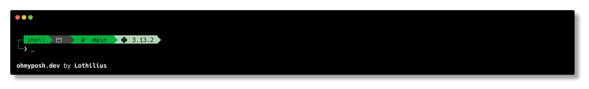

# Austin FC Stuff

A collection of Austin FC themes for oh-my-posh along with tools to track 
and display Austin FC game schedules and information.

## Overview

This project provides utilities to:
- Austin FC theme for oh-my-posh
- Fetch and parse the current Austin FC MLS schedule
- Track countdown to games for oh-my-posh theme

## Example Display




## Components

### Schedule Parser

`austinfc_days_til.py` - A Python script that:
- Scrapes Austin FC schedule data from plaintextsports.com
- Parses game information (dates, opponents, locations)
- Outputs formatted schedule data to a markdown file

### Next Game Finder

`next_austin_fc_game_linux.sh` - A shell script that:
- Check if schedule markdown file is present
- If not, copy the latest schedule from the repository
- Reads the schedule markdown file
- Determines the next upcoming game
- Calculates days until the next match
- Displays formatted game information

### Terminal Integration

`austinfc.omp.yml` - An Oh My Posh theme configuration for terminal customization with:
- Green Austin FC branded colors
- Git status information
- Countdown timer integration

## Usage

## Set Oh My Posh Theme
1. Install [Oh My Posh](https://ohmyposh.dev/docs/installation)
2. Install nerd fonts. 
   ```bash
   brew tap homebrew/cask-fonts
   brew install --cask font-hack-nerd-font
   ```
2. Install the theme using the command:
   ```bash
   oh-my-posh init --shell bash --config austinfc.omp.yml --apply
   ```

### Running the Schedule Parser

  ```bash
  python austinfc_days_til.py
  ```
